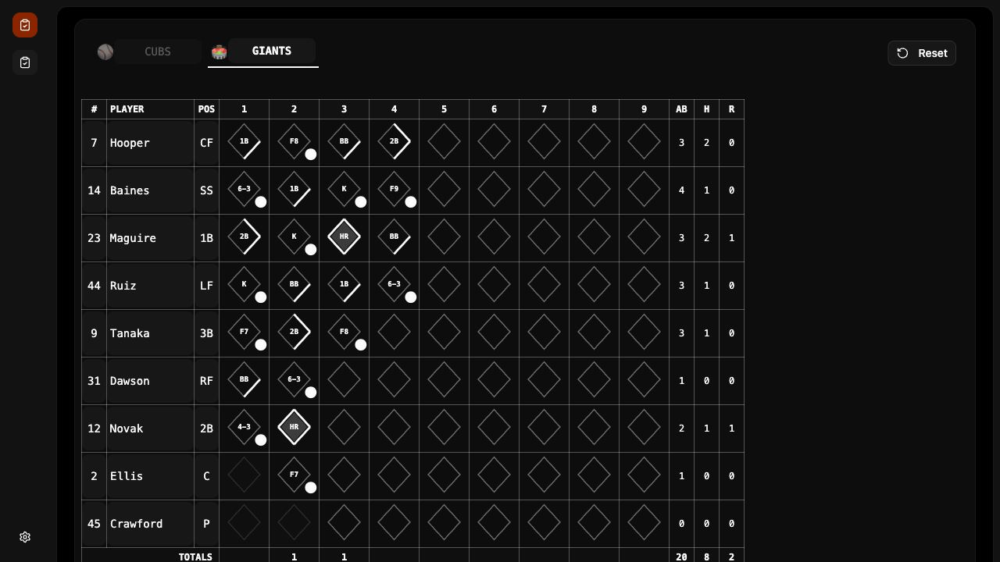

<p align="center">
  
</p>

<h1 align="center">Scorecard</h1>

<h3 align="center" style="font-weight: normal;">
  Baseball scorecard app with diamond-based at-bat tracking
</h3>
<p align="center">
  <a href="https://opensource.org/licenses/mit">
    
  </a>
  <a href="https://github.com/stevederico/scorecard/stargazers">
    
  </a>
</p>

## About

A baseball scorecard built with React and a zero-crate Rust backend. Track at-bats with diamond-based notation, manage lineups, and score games using standard baseball shorthand (K, BB, 6-3, F8, HR, etc).

### Features

- **Diamond at-bat boxes** — visual base path tracking per plate appearance
- **9-inning grid** — full lineup with 9 batting slots
- **Standard notation** — K, BB, 1B, 2B, 3B, HR, F7, 6-3, DP, and custom entries
- **Out tracking** — automatic out numbering with 3-out-per-inning enforcement
- **Base advancement** — toggle individual bases for runner tracking
- **Live stats** — AB, H, R totals per player and per inning
- **Dark mode** — full dark mode support

## Quick Start

```bash
git clone https://github.com/stevederico/scorecard.git
cd scorecard
npm install
npm run start          # frontend on :5173
cd backend && cargo run   # backend on :8000
```

App runs at `http://localhost:5173`

## Tech Stack

| Technology | Purpose |
|---|---|
| React 19 | UI |
| Vite 8 | Build & dev server |
| Tailwind CSS v4 | Styling |
| Shadcn/ui | Components |
| Rust (zero-crate) | Backend server |
| SQLite (libsqlite3) | Database |
| Skateboard-ui | Application shell |

## Project Structure

```
scorecard/
├── src/
│   ├── components/
│   │   └── BaseballView.tsx   # Scorecard component
│   ├── main.tsx               # Routes
│   ├── constants.json         # App config
│   └── legal.json             # Terms, privacy, EULA bodies
├── backend/
│   ├── src/                   # Rust API server (routes.rs, db.rs, …)
│   ├── Cargo.toml             # Zero-crate: [dependencies] stays empty
│   └── config.json            # Static dir + database config
└── package.json
```

## License

MIT License — see [LICENSE](LICENSE) for details.

---

<div align="center">
  Built by <a href="https://github.com/stevederico">Steve Derico</a>
  <br />
  Made with <a href="https://github.com/stevederico/skateboard">Skateboard</a> — a React boilerplate with auth and payments
</div>
